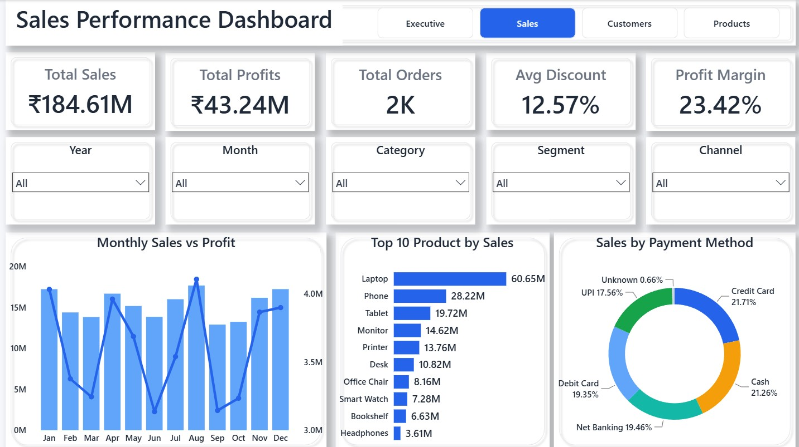

# Retail Sales Analytics

An end-to-end retail sales analytics project built using **Python, Snowflake, SQL, and Power BI**.

The project demonstrates the complete data analytics workflow, from data cleaning and cloud data warehousing to 
incremental data processing and interactive business intelligence dashboards.

---

## 📌 Project Overview

The objective of this project is to build a scalable retail sales analytics solution that transforms raw retail data into meaningful business insights.

The project covers:

- Data cleaning and preprocessing using Python
- Cloud data warehousing using Snowflake
- Raw, staging, and analytics layers
- Star schema data modeling
- Fact and dimension tables
- Sales and profit calculations
- Incremental data processing using Snowflake Streams
- Automated processing using Snowflake Tasks
- MERGE-based upsert logic
- DAX measures and interactive Power BI dashboards
- Business analysis across sales, customers, and products

---

## 🏗️ Project Architecture

```text
Raw Retail Data
       │
       ▼
   Python / Colab
       │
       │ Data Cleaning & Validation
       ▼
   Snowflake Stage
       │
       ▼
   RAW Layer
       │
       ▼
  STAGING Layer
       │
       ├───────────────┐
       │               │
       ▼               ▼
 Dimension Tables    FACT_SALES
       │               │
       └───────┬───────┘
               ▼
        Analytics Layer
               │
       Streams + Tasks
               │
          MERGE / Upsert
               │
               ▼
           Power BI
               │
               ▼
      Interactive Dashboard


🛠️ Technologies Used
Technology	Purpose
Python	Data cleaning, preprocessing, and validation
Google Colab	Python development environment
Snowflake	Cloud data warehouse
SQL	Data transformation, modeling, and automation
Snowflake Streams	Change data capture
Snowflake Tasks	Automated incremental processing
MERGE	Insert/update processing
Power BI	Data modeling, DAX, visualization, and dashboarding
GitHub	Version control and project documentation


-- Project Structure
retail-sales-analytics/
│
├── Python/
│   ├── retail_sales_cleaning.ipynb
│   └── retail_sales_cleaning.py
│
├── Snowflake/
│   ├── 01_environment_setup.sql
│   ├── 02_raw_layer_and_stage.sql
│   ├── 03_raw_load.sql
│   ├── 04_staging_and_business_logic.sql
│   ├── 05_analytics_model.sql
│   ├── 06_customer_incremental_automation.sql
│   ├── 07_validation.sql
│   └── README.md
│
├── PowerBI/
│   └── Retail_Sales_Analytics.pbix
│
└── README.md


🐍 Python Data Preparation
Python was used as the initial data preparation layer.

The workflow included:
Loading the source files
Inspecting the dataset structure
Handling missing values
Standardizing categorical values
Cleaning inconsistent data
Validating the cleaned datasets
Preparing CSV files for Snowflake ingestion

The cleaned datasets were then loaded into Snowflake.

❄️ Snowflake Data Warehouse

Snowflake was used as the centralized analytical data warehouse.

The warehouse contains three main layers:

RAW

Stores the cleaned source data with minimal transformation.

Tables include:

CUSTOMER_RAW
PRODUCT_RAW
ORDER_RAW
ORDER_ITEM_RAW
RETURNS_RAW
MARKETING_RAW
STAGING

Contains staging copies of the raw tables and supports transformation and business logic.

Tables include:

CUSTOMER_STG
PRODUCT_STG
ORDER_STG
ORDER_ITEM_STG
RETURNS_STG
MARKETING_STG
ANALYTICS

Contains the final analytical model used by Power BI.

⭐ Data Model

The analytical layer follows a star schema.

Fact Table
FACT_SALES

The grain of the fact table is one order-item transaction.

Important measures include:

Quantity
Unit Price
Gross Sales
Discount Amount
Net Sales
Total Cost
Profit
Dimension Tables
DIM_CUSTOMER

Contains customer attributes such as:

Customer ID
Customer Name
Gender
Age
City
State
Customer Segment
Signup Date
DIM_PRODUCT

Contains:

Product ID
Product Name
Category
List Price
Unit Cost
DIM_DATE

Contains:

Date
Year
Quarter
Month Number
Month Name
Day
Day Name

💰 Sales Calculations

The project calculates key business metrics at the order-item level.

Gross Sales
Quantity × Unit Price
Discount Amount
Gross Sales × Discount %
Net Sales
Gross Sales − Discount Amount
Total Cost
Quantity × Unit Cost
Profit
Net Sales − Total Cost

The DISCOUNT_PCT field is stored as a whole-number percentage, where 10 represents 10%.

🔄 Incremental Data Processing

One of the main objectives of the project was to demonstrate incremental processing rather than repeatedly processing the complete dataset.

Snowflake Streams were used to capture changes from the source table.

RAW.CUSTOMER_RAW
        │
        ▼
CUSTOMER_STREAM
        │
        ▼
      MERGE
        │
        ▼
STAGING.CUSTOMER_STG

The MERGE logic handles:

Existing customer updates
New customer inserts

⚙️ Snowflake Task Automation

A Snowflake Task was created to automate the incremental processing.

The task checks whether the stream contains changes and executes the MERGE when new change data is available.

Source Change
      ↓
Snowflake Stream
      ↓
Stream Has Data?
      ↓
     Yes
      ↓
     MERGE
      ↓
Staging Table Updated

This avoids unnecessarily processing the complete customer dataset for every execution.

📊 Power BI Dashboard

The final Power BI report contains four interactive pages.

1. Executive Dashboard

Provides an overall business overview using:

KPI cards
Monthly sales trend
Sales by category
Sales by channel
Interactive slicers
2. Sales Performance Dashboard

Focuses on sales and profitability.

Key analysis includes:

Total Sales
Total Profit
Total Orders
Average Discount
Profit Margin
Monthly Sales vs Profit
Top 10 Products
Sales by Payment Method
3. Customer Insights Dashboard

Focuses on customer behavior and contribution.

Key analysis includes:

Total Customers
Sales per Customer
Orders per Customer
Average Order Value
Average Discount
Sales by Customer Segment
Top 10 Customers
Sales by State
4. Product Analysis Dashboard

Focuses on product performance.

Key analysis includes:

Total Sales
Total Profit
Total Quantity
Profit Margin
Average Discount
Sales by Product Category
Top 10 Products by Profit
Quantity Sold by Category

🎨 Dashboard Design

The Power BI report uses a consistent professional design system across all four pages.

Features include:

Consistent background
Consistent KPI cards
Consistent slicers
Professional blue-based color palette
Clear visual hierarchy
Page navigation
Interactive filtering
Consistent spacing and alignment

The report uses a custom Page Navigator so users can move between:

Executive → Sales → Customers → Products

📈 Business Questions Answered

The dashboard helps answer questions such as:

What are the overall sales and profit levels?
How are sales changing over time?
Which categories generate the most sales?
Which products generate the highest profit?
Which payment methods contribute most to sales?
Which customer segments generate the most revenue?
Which customers are the highest-value customers?
Which states generate the most sales?
How much quantity is being sold across categories?

🔑 Key Learning Outcomes

Through this project, I worked with:

Python data cleaning
SQL
Snowflake architecture
Data warehousing
Star schema modeling
Fact and dimension tables
Data transformation
Snowflake Streams
Snowflake Tasks
MERGE operations
Incremental data processing
Power BI
DAX
Interactive dashboard development
Business-oriented data visualization

🚀 Future Improvements

Potential future enhancements include:

Automated cloud data ingestion
Additional incremental pipelines
Customer retention analysis
Product-level profitability analysis
Marketing ROI analysis
Advanced Power BI drill-through pages
Row-level security
Scheduled Power BI refresh
Production deployment using separate development and production environments

👤 Author
Bipin Kumar

This project was created as an end-to-end data analytics and business intelligence portfolio project using Python, Snowflake, SQL, and Power BI.
